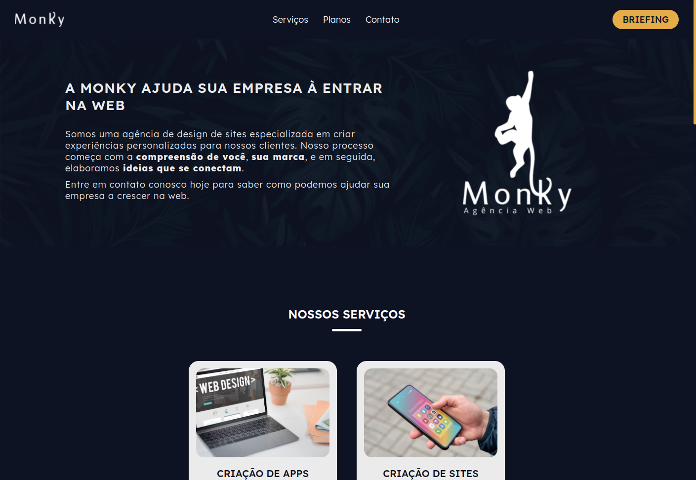
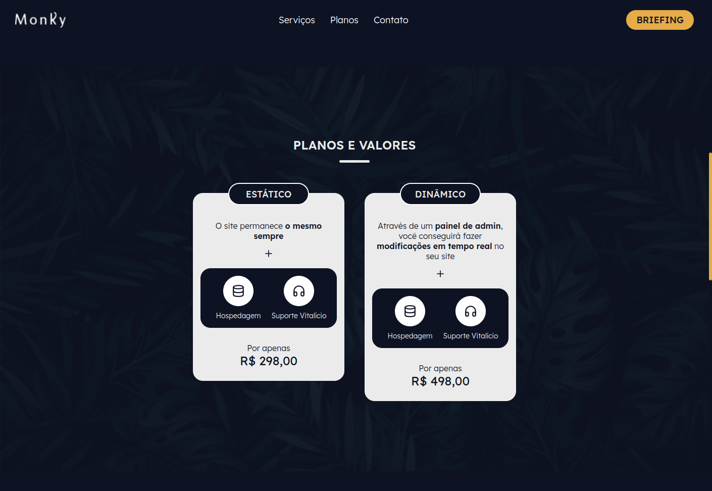
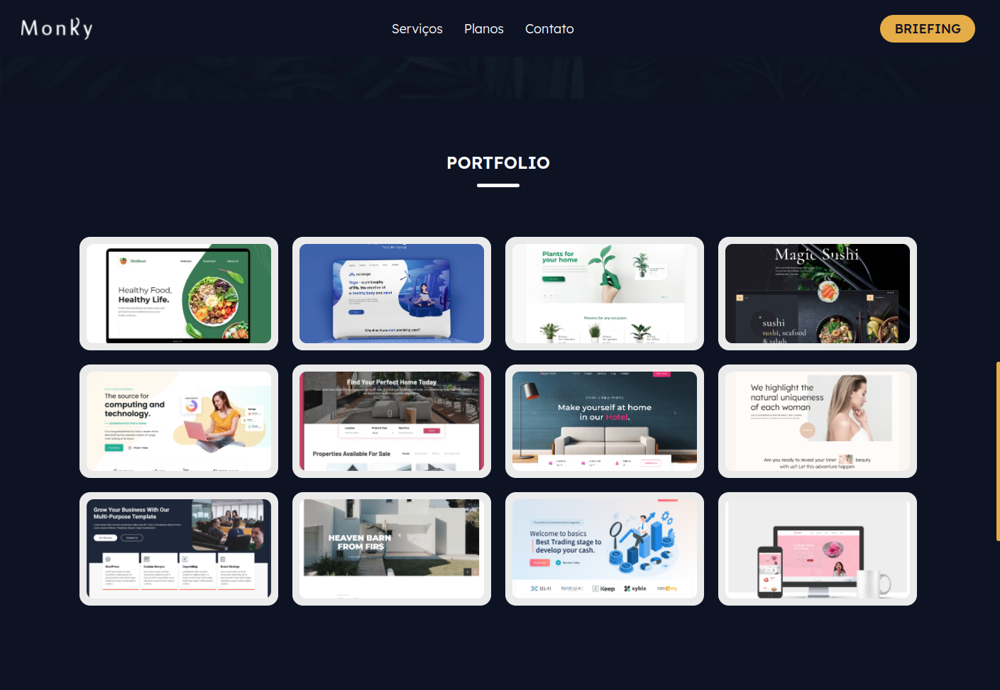
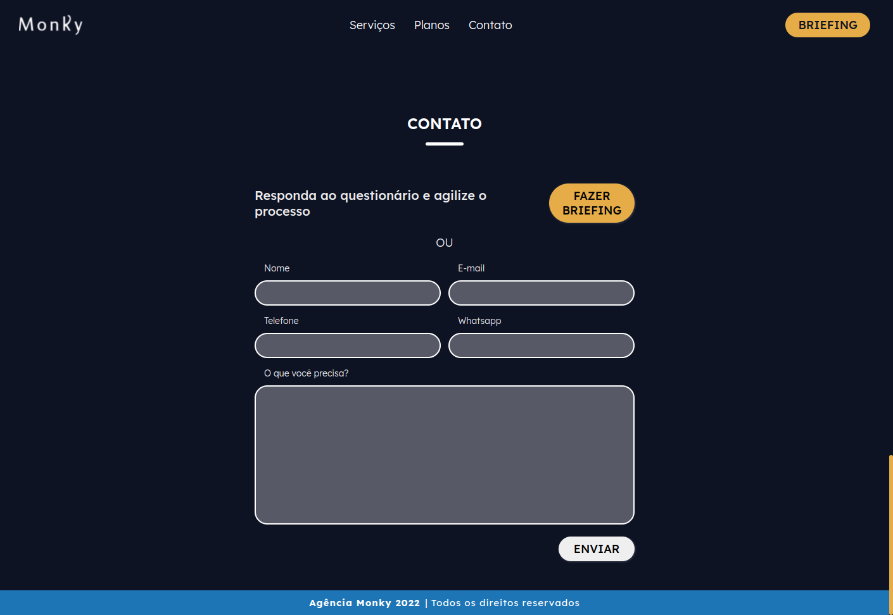

### Agência Monky Website

> Desenvolvedores: [Henrique Garcia](https://www.linkedin.com/in/henrique-p-garcia/) e [Marcus Vinícius](https://www.linkedin.com/in/marcus-vinicius-santos-da-rosa-18479b1a3/)  
> Status: Em desenvolvimento  
> Behance: [Link](https://www.behance.net/gallery/142366503/Agencia-Monky-Website)

#### Tecnologias

- React JS - Front-End
- Firebase - Hosting
- Draw.io - Design, UI & UX

#### Features

- Animações
- Scroll da página no clique do menu
- Logo única desenvolvida para o projeto
- SEO e copywrite da página

#### Screenshots

